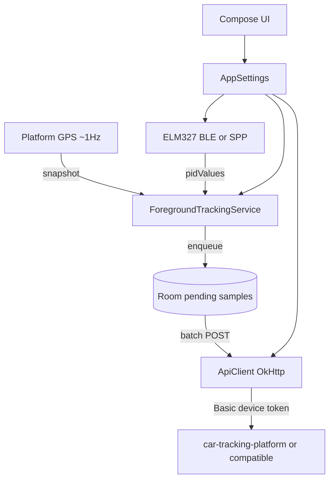

<div align="center">

# 📍 GPS Car Tracking

### Android telemetry client · GPS + OBD-II · offline queue · your backend

[](LICENSE)
[](https://kotlinlang.org/)
[](https://developer.android.com/jetpack/compose)
[](https://openjdk.org/)
[](docs/fdroid/)
[](docs/obtainium/)

**Phone GPS and live ELM327 metrics → Room queue → batch upload to a server you control.**

🛰️ ~1 Hz GPS snapshots · 🔌 BLE or Classic SPP OBD · 📦 durable offline queue · 🔓 MIT · no GMS

<br/>

| 📡 **Capture** | 🔧 **OBD** | 📤 **Upload** | 🏠 **Own it** |
|:---:|:---:|:---:|:---:|
| Foreground GPS + session | Hot/slow PID poll | Room queue + batch POST | Self-host or any compatible API |

</div>

---

## ✨ Features

| | |
|:---|:---|
| 🔔 **Foreground tracking** | Continuous platform location (system fused on Android 12+, else GPS) with notification controls |
| 📶 **Native OBD** | ELM327 over **BLE GATT** (default) or **Classic Bluetooth SPP**; selectable protocol (default ISO 15765-4 CAN 11-bit 500 kbaud); auto-reconnect |
| 🚦 **ECU-driven session** | Tracking starts when the ECU responds and stops when it drops |
| ⚡ **Prioritized PID poll** | Hot PIDs (RPM, speed, load, MAF, …) every round; slow PIDs every 5th round at max adapter rate |
| 📬 **Durable send queue** | Room-backed pending samples; ~60 s batch flush with retry / backoff |
| ⛽ **Vehicle & fuel math** | Presets (E0/E10/E27/E100/Custom), AFR, density, displacement, VE → estimated L/h from MAF + λ (MAP fallback; peak-air idle MAF sanitized) |
| 🧪 **OBD debug log** | Init steps, BLE lifecycle, errors (Debug tab) — not full successful TX/RX spam |
| 📊 **Dashboard** | Live gauges and metrics while tracking |
| 📱 **QR bootstrap** | Scan platform provisioning QR for token, track URLs, fuel/engine, optional car name |

---

## 🏗️ Architecture



```text
Phone GPS (~1 Hz)  ──►  sample + latest OBD snapshot  ──►  local queue  ──►  batch HTTP API
OBD (BLE or SPP)  ──►  pidValues (hot/slow PIDs)  ──────┘
```

| Layer | Role |
|:------|:-----|
| `ForegroundTrackingService` | GPS fixes, build samples, enqueue, session start/stop |
| `ObdBleManager` | ELM session (GATT or RFCOMM), PID poll, `pidValues` / `ecuConnected` / `vehicleOn` |
| `SampleQueueRepository` + `SampleQueueUploader` | Persist unsent rows; batch POST |
| `ApiClient` | OkHttp `start` / `stop` / `sample` / `samples` |
| `AppSettings` | SharedPreferences (URLs, token, BLE, protocol, fuel) |
| Compose UI | Dashboard, Settings, Debug console, About |

```text
GPSCarTracking/
├── composeApp/
│   ├── src/androidMain/      # 🤖 service · OBD BLE/SPP · Room queue · API
│   ├── src/commonMain/       # ✨ Compose UI · fuel math · shared models
│   └── src/androidUnitTest/  # 🧪 JUnit
├── fastlane/metadata/        # 🏪 F-Droid / store text
├── docs/fdroid/              # 📦 recipe draft + submission notes
├── docs/obtainium/           # 📲 Obtainium stable + continuous configs
├── docs/plans/               # 📝 design notes
└── devenv.nix                # 🧰 JDK 21 + Android SDK shell
```

Design notes for recent work live under [`docs/plans/`](docs/plans/).

---

## 📋 Requirements

| Item | Notes |
|:-----|:------|
| 📱 **Android device** | BLE + location; Android 8+ recommended |
| ☕ **JDK** | **21** (see `devenv.nix` / `JAVA_HOME`) |
| 🛠️ **Android SDK** | Android Studio or [devenv](https://devenv.sh) |
| 🔌 **OBD adapter** | ELM327-compatible **BLE** and/or **Classic SPP**. Dual-mode sticks: pick transport in Settings |
| 🖥️ **Backend** | [my-car-tracking-platform](https://github.com/lfdominguez/my-car-tracking-platform) or any wire-compatible `/api/track/*` API |

---

## 🚀 Quick start

### 1️⃣ Dev shell & SDK path

```bash
# Optional: reproducible shell (Nix + devenv)
devenv shell

cp local.properties.example local.properties
# local.properties:
#   sdk.dir=/path/to/Android/Sdk
```

### 2️⃣ Build & install

```bash
./gradlew :composeApp:assembleDebug
# APK: composeApp/build/outputs/apk/debug/composeApp-debug.apk
```

### 3️⃣ Configure in the app

Install the debug APK, open **Settings**, then:

1. **Preferred:** on the web platform → car → **device** → scan the **QR** (token, track URLs, fuel/engine, optional car name)
2. **Or manual:** **API token** (raw device token for `Authorization: Basic <token>`) + absolute `/api/track/start|stop|sample|samples` URLs
3. Tap **Test connection** — public `/health`, then a short start/stop smoke with your device token
4. **Bluetooth transport** — **BLE (GATT)** default, or **Classic SPP** for RFCOMM “OBDII” sticks  
   Classic: pair in system Bluetooth first (PIN often `1234` / `0000`), fully quit Torque/other OBD apps, then Scan
5. **Adapter** — scan, select, save (auto-reconnect next time)
6. **OBD protocol** — leave default CAN 11/500 unless your car needs another
7. **Vehicle & fuel** — usually filled from QR; adjust if needed

Grant **location (always)** and **Bluetooth** permissions when prompted.

---

## 🔐 Configuration & secrets

**Never commit real tokens, private hostnames, or `local.properties`.**

| Setting | Public default |
|:--------|:---------------|
| API token | empty — set in-app |
| API URLs | `https://YOUR_SERVER.example/api/track/...` |
| `local.properties` | gitignored (`sdk.dir`) |
| BLE MAC | on-device only |

If a credential was ever committed, **rotate it on the server** and consider rewriting history so the old blob is unreachable.

---

## 📡 Backend contract

Companion platform: [my-car-tracking-platform](https://github.com/lfdominguez/my-car-tracking-platform) · optional hosted instance: [mycar.domivega.com](https://mycar.domivega.com) (user-configured only).

| Method | Path | Notes |
|:-------|:-----|:------|
| `POST` | `…/start` | Body `{ "timestamp_start": "<RFC3339>" }` · tracking id from JSON `id` if present, else client millis string |
| `POST` | `…/stop` | `{ "id": "<tracking_id>" }` |
| `POST` | `…/sample` | Single sample (legacy) |
| `POST` | `…/samples` | `{ "samples": [ … ] }` batch (**preferred**) |
| `GET` / `HEAD` | `/health` | Public probe used by **Test connection** |

Header: `Authorization: Basic <device_token>` (plaintext device token from the web platform).

OBD metric fields may be missing — backends should treat them as optional so GPS-only or partial OBD points are kept.

<details>
<summary>🦀 Rust platform notes</summary>

- Start body sends `timestamp_start` as an **ISO-8601 / RFC3339** instant (not a raw millis number).
- If start returns an empty body (current Rust API), the app uses the client epoch-millis string as `tracking_id` so samples still attach.
- Platform QR JSON is camelCase (`apiToken`, `startUrl`, `fuelType`, `carId`, `carName`, …); unknown keys are ignored.

</details>

---

## 🧰 Development

```bash
./gradlew :composeApp:testDebugUnitTest
./gradlew :composeApp:assembleDebug
./gradlew :composeApp:assembleRelease
# release: composeApp/build/outputs/apk/release/composeApp-release-unsigned.apk
```

With devenv:

```bash
devenv shell -- ./gradlew :composeApp:testDebugUnitTest
```

See **[AGENTS.md](AGENTS.md)** for conventions when contributing with AI coding agents.

---

## 🌿 Branching & releases

Production is **`main`** (protected). Develop on `feature/*`, open a PR, merge when CI is green.

**Continuous signed APK** (every push to `main`, same release cert):  
[com.domivega.gps_car-latest.apk](https://github.com/lfdominguez/my-car-tracking-mobile-app/releases/download/latest/com.domivega.gps_car-latest.apk)  
— sideload channel only; see [`docs/RELEASE.md`](docs/RELEASE.md) (Actions secrets + `versionCode` notes). Obtainium config: [`docs/obtainium/continuous.json`](docs/obtainium/continuous.json).

To cut a user-facing / F-Droid version (bumps Gradle `versionName` / `versionCode`, tags, signed GitHub Release APK):

```bash
scripts/create-release.sh 1.1 --notes "Your release notes"
```

Full workflow: [`docs/RELEASE.md`](docs/RELEASE.md).

---

## 📲 Obtainium

[Obtainium](https://obtainium.imranr.dev/) can track this GitHub repo. Use a config so it does **not** grab the CI unsigned APK or mix store `versionCode`s with the rolling `latest` build.

| Channel | Add in Obtainium | APK filter |
|:--------|:-----------------|:-----------|
| **Stable** (F-Droid / `v*` line) | [Add stable](https://apps.obtainium.imranr.dev/redirect?r=obtainium://app/%7B%22id%22%3A%22com.domivega.gps_car%22%2C%22url%22%3A%22https%3A%2F%2Fgithub.com%2Flfdominguez%2Fmy-car-tracking-mobile-app%22%2C%22author%22%3A%22lfdominguez%22%2C%22name%22%3A%22GPS%20Car%20Tracking%22%2C%22additionalSettings%22%3A%22%7B%5C%22apkFilterRegEx%5C%22%3A%5C%22com%5C%5C%5C%5C.domivega%5C%5C%5C%5C.gps_car_%5C%5C%5C%5Cd%2B%5C%5C%5C%5C.apk%5C%22%2C%5C%22includePrereleases%5C%22%3Afalse%7D%22%7D) | `com.domivega.gps_car_<digits>.apk` · prereleases off |
| **Continuous** (`latest` only) | [Add continuous](https://apps.obtainium.imranr.dev/redirect?r=obtainium://app/%7B%22id%22%3A%22com.domivega.gps_car%22%2C%22url%22%3A%22https%3A%2F%2Fgithub.com%2Flfdominguez%2Fmy-car-tracking-mobile-app%22%2C%22author%22%3A%22lfdominguez%22%2C%22name%22%3A%22GPS%20Car%20Tracking%20%28latest%29%22%2C%22additionalSettings%22%3A%22%7B%5C%22apkFilterRegEx%5C%22%3A%5C%22com%5C%5C%5C%5C.domivega%5C%5C%5C%5C.gps_car-latest%5C%5C%5C%5C.apk%5C%22%2C%5C%22includePrereleases%5C%22%3Atrue%2C%5C%22filterReleaseTitlesByRegEx%5C%22%3A%5C%22latest%5C%22%2C%5C%22useLatestAssetDateAsReleaseDate%5C%22%3Atrue%2C%5C%22releaseDateAsVersion%5C%22%3Atrue%2C%5C%22versionDetection%5C%22%3Afalse%7D%22%7D) | `com.domivega.gps_car-latest.apk` · not the store line |

Same package id — pick **one** channel. Details and JSON: [`docs/obtainium/`](docs/obtainium/).

---

## 📦 F-Droid / free builds

Built to stay **F-Droid-friendly**:

| Check | Status |
|:------|:-------|
| License | **MIT** ([`LICENSE`](LICENSE)) |
| Play Services / Firebase | **None** — platform `LocationManager` / system fused on 12+ |
| Ads / crash SDKs | **None** |
| Build-time secrets | **None** — token & URLs in Settings |
| Store text | [`fastlane/metadata/android/en-US/`](fastlane/metadata/android/en-US/) |
| Recipe + steps | [`docs/fdroid/`](docs/fdroid/) · [fdroiddata MR](https://gitlab.com/fdroid/fdroiddata/-/merge_requests/45659) |

Package id: `com.domivega.gps_car` · first tag: `v1.0`.

F-Droid signs its own builds; ship the **unsigned** release APK path only.

---

## ⚠️ Disclaimer

OBD fuel rate is **estimated** unless you extend the stack to prefer ECU PIDs such as `01 5E`. Use at your own risk; **do not interact with the phone while driving**.

---

<div align="center">

## 📜 License

**[MIT License](LICENSE)** · `MIT`

<br/>

**Kotlin · Compose · your car · your server**

`⭐` If this helps your garage — star the repo

</div>
